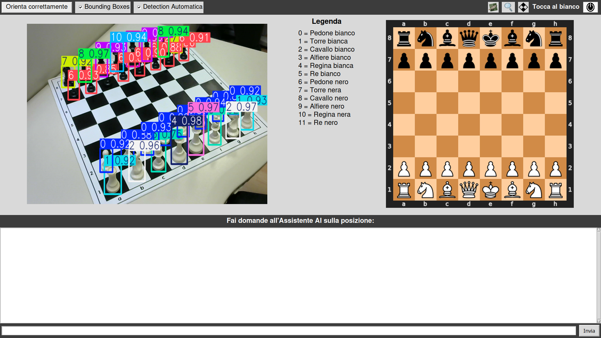
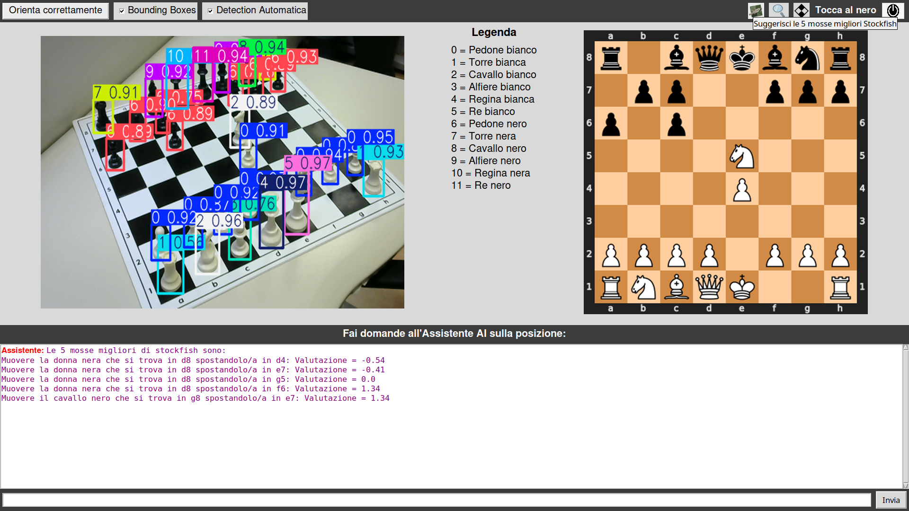
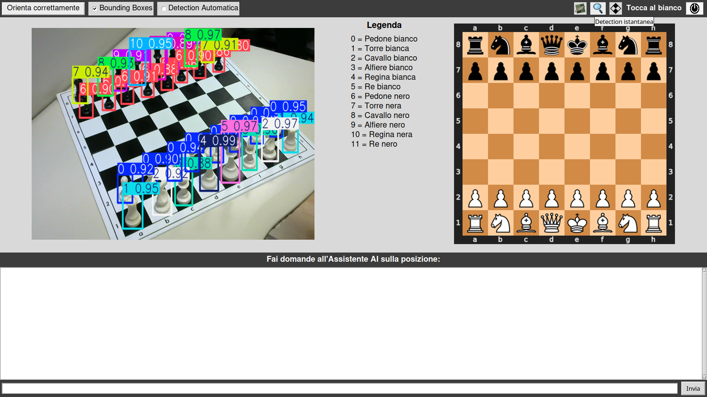
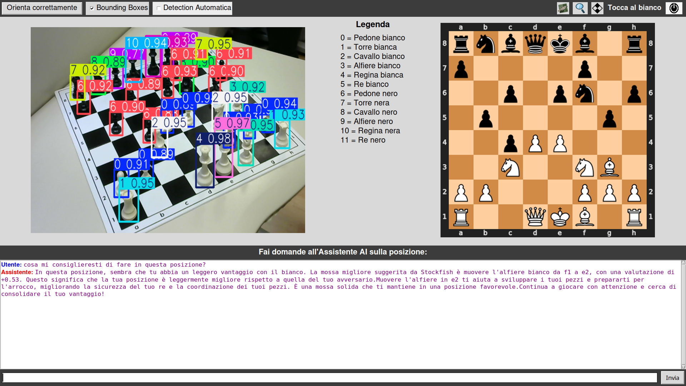
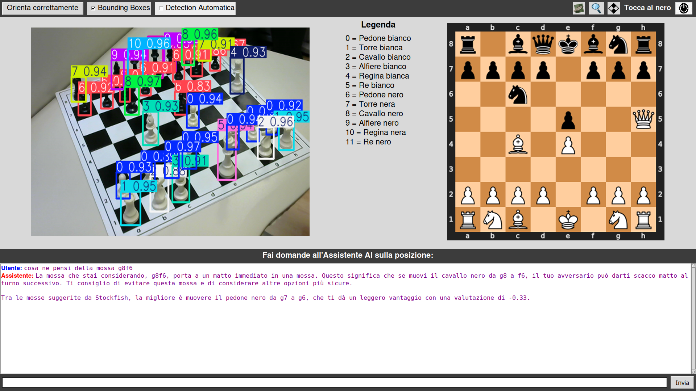
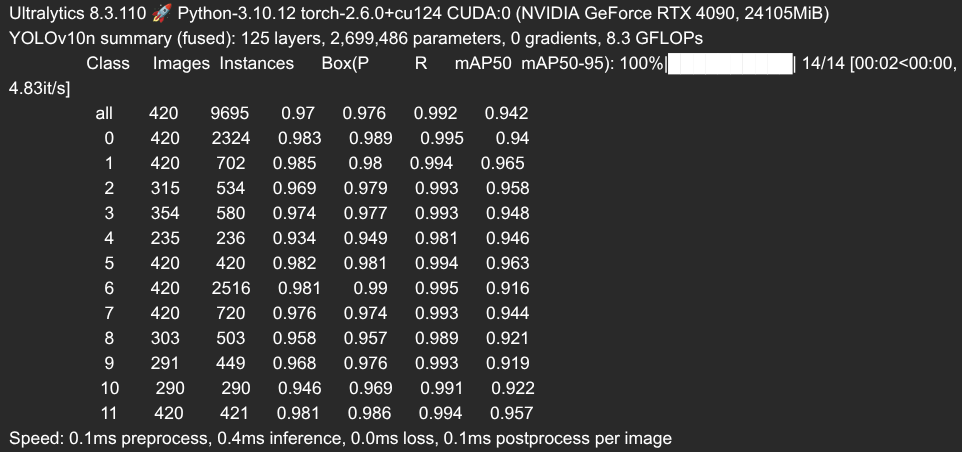

# Chess Assistant AI
Chess Assistant AI è un'applicazione sviluppata in Python che integra tecniche di [computer vision](https://en.wikipedia.org/wiki/Computer_vision#:~:text=11%20External%20links-,Definition,human%20visual%20system%20can%20do.), un [LLM](https://en.wikipedia.org/wiki/Large_language_model) come ChatGPT o Gemini (a seconda della scelta dell'utente) e il motore scacchistico [Stockfish](https://github.com/official-stockfish/Stockfish), offrendo un'esperienza interattiva che aiuta gli appassionati di scacchi a comprendere meglio le mosse giocate durante una partita.


## Descrizione
L'applicazione utilizza [YOLOv10](https://docs.ultralytics.com/models/yolov10/) per il riconoscimento dei pezzi in tempo reale su una scacchiera fisica. Durante l'esecuzione, vengono visualizzate le bounding box attorno ai pezzi rilevati (complete di etichettatura con la rispettiva [classe del pezzo](#classi-associate-ai-pezzi)). Il sistema identifica le quattro torri nella posizione di partenza per determinare gli angoli della scacchiera e applica una trasformazione omografica per convertire la vista prospettica in una mappa 2D, utile a stabilire la posizione precisa di ciascun pezzo su una griglia virtuale.
L'applicazione integra:
- Stockfish: per sapere in ogni momento quali sono le mosse migliori nella posizione e la loro rispettiva valutazione.
- ChatGPT/Gemini: per eventuali domande sulla posizione (necessaria una chiave API)
 
## Classi associate ai pezzi
- Classe 0  →  Pedone bianco
- Classe 1  →  Torre bianca
- Classe 2  →  Cavallo bianco
- Classe 3  →  Alfiere bianco
- Classe 4  →  Regina bianca
- Classe 5  →  Re bianco
- Classe 6  →  Pedone nero
- Classe 7  →  Torre nera
- Classe 8  →  Cavallo nero
- Classe 9  →  Alfiere nero
- Classe 10 →  Regina nera
- Classe 11 →  Re nero

## Funzionalità
- Ogni 4 secondi la posizione viene aggiornata
- Tasto con l'icona di Stockfish per ottenere nella chat in basso le 5 mosse migliori di Stockfish con la loro rispettiva valutazione

- Tasto per riallineare la scacchiera, utile nel caso in cui la telecamera o la scacchiera siano state spostate. È fondamentale che le torri si trovino nei 4 angoli durante l'operazione di riallineamento
- Checkbox per attivare/disattivare il riconoscimento dei pezzi in real time
- Tasto con l'icona di una lente di ingrandimento, per riconoscere la posizione sulla scacchiera (nel caso in cui il riconoscimento real time sia disattivato)

- Checkbox per attivare/disattivare la visualizzazione delle bounding box attorno ai pezzi riconosciuti
- Tasto per cambiare il turno del giocatore che deve muovere

- Possibilità di interrogare ChatGPT o Gemini (in base alla chiave API configurata) per ottenere la valutazione della posizione e consigli generali

- Possibilità di chiedere a ChatGPT la valutazione di una mossa fornita dall'utente (la mossa deve essere fornita in formato UCI, ad esempio e2e4, g8f6...)


## Requisiti
- Telecamera che riprenda la scacchiera
- La telecamera deve essere posizionata in basso a sinistra rispetto alla scacchiera, mantenendo la prospettiva del bianco.
- Per utilizzare ChatGPT nella chat integrata, è necessario fornire una chiave API OpenAI, da inserire nel file `keys.env` all'interno della variabile OPENAI_API_KEY
- Per utilizzare Gemini nella chat integrata, è necessario fornire una chiave API Gemini, da inserire nel file `keys.env` all'interno della variabile GEMINI_API_KEY

## Installazione ed esecuzione dell'applicazione
1. Clona il repository:
```bash
git clone https://github.com/tuo-username/nome-progetto.git
cd ChessAssistantAI
```
2. Installa le dipendenze
Crea un ambiente virtuale ed esegui il comando `pip install -r requirements.txt` per installare tutte le dipendenze
3. Installazione di Stockfish:
scarica l'eseguibile di Stockfish direttamente dal [repository ufficiale](https://github.com/official-stockfish/Stockfish) su GitHub
4. Configurare le chiavi API 
Inserire all'interno del file keys.env la chiave API di OpenAI o di Gemini seguendo il formato:<br>
**OPENAI_API_KEY=la-tua-chiave**<br>
**GEMINI_API_KEY=la-tua-chiave**<br>
(In presenza di entrambe le chiavi verrà data priorità a quella di OpenAI)
5. Esegui lo script `main.py` per avviare l'applicazione.

## Training
Il modello per l'Object Detection dei pezzi è già incluso nel repository con il nome `modello.pt`, ed è stato addestrato ottenendo i seguenti risultati:

È comunque possibile eseguire l'addestramento da zero utilizzando il file `train.py` e il dataset disponibile al seguente link:

## Demo
In questo breve video viene illustrato il funzionamento dell'applicazione: [https://youtu.be/WZLR9H4znxg](https://youtu.be/WZLR9H4znxg)

## Licenza
